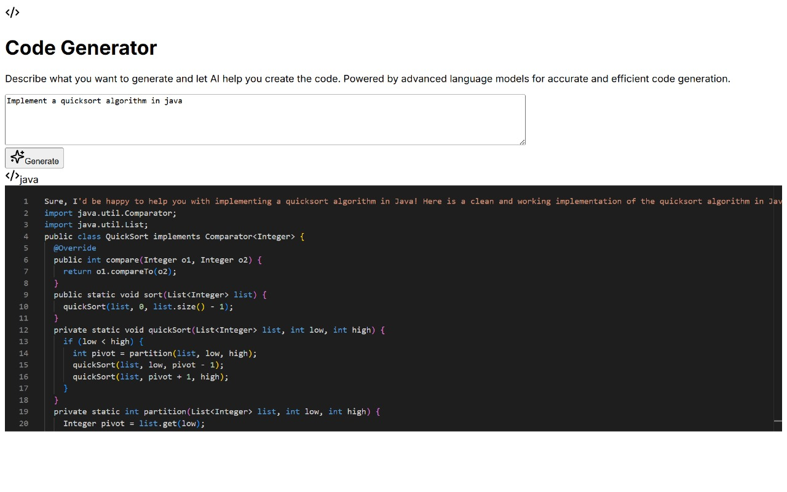

# CodeGenie: AI Code Generator

An AI-powered code generation tool that helps developers quickly generate high-quality code snippets in multiple programming languages.

## Features

- 🤖 AI-powered code generation using Google's Gemini 1.5 Flash
- 🎨 Beautiful, modern UI with dark theme
- 💻 Support for multiple programming languages:
  - Python
  - TypeScript
  - Java
  - C++
  - Rust
  - Go
- ✨ Automatic language detection
- 🎯 Clean code output with proper formatting
- 🚀 Real-time code editing with syntax highlighting

## Documentation & Examples

For detailed documentation and examples, please refer to our comprehensive guide:
[CodeGenie - Hackathon Sample Project with template.pdf](codegen-%20Hackathon%20Sample%20Project%20with%20template.pdf)

### Quick Example:

Here's a sample of generating a QuickSort implementation in Java:

### Input Prompt:
```
Implement a quicksort algorithm in java
```

### Generated Output:



The AI automatically:
- Detected Java as the target language
- Generated a complete, working implementation
- Added proper imports and class structure
- Included method documentation
- Applied correct formatting and indentation

## Tech Stack

- Next.js 13+ with App Router
- TypeScript
- Tailwind CSS
- Google Gemini 1.5 Flash API
- Monaco Editor

## Getting Started

1. Clone the repository:
```bash
git clone https://github.com/[your-username]/codegenie.git
cd codegenie
```

2. Install dependencies:
```bash
npm install
# or
yarn install
```

3. Set up your Gemini API key:
   - Get your API key from [Google AI Studio](https://makersuite.google.com/app/apikey)
   - Create a `.env.local` file and add your API key:
```
GEMINI_API_KEY=your_api_key_here
```

4. Run the development server:
```bash
npm run dev
# or
yarn dev
```

5. Open [http://localhost:3000](http://localhost:3000) in your browser.

## Usage

1. Enter your code requirements in the text area
2. Select your preferred programming language (or let it auto-detect)
3. Click "Generate" to create the code
4. The generated code will appear in the editor below
5. Edit the code if needed

## API Usage Notes

- The Gemini API requires authentication via an API key
- You can get a free API key from Google AI Studio
- The free tier includes generous usage limits
- For more information, visit [Google AI Studio](https://makersuite.google.com/)

## License

MIT License - feel free to use this project for any purpose.

## Contributing

Contributions are welcome! Please feel free to submit a Pull Request. 